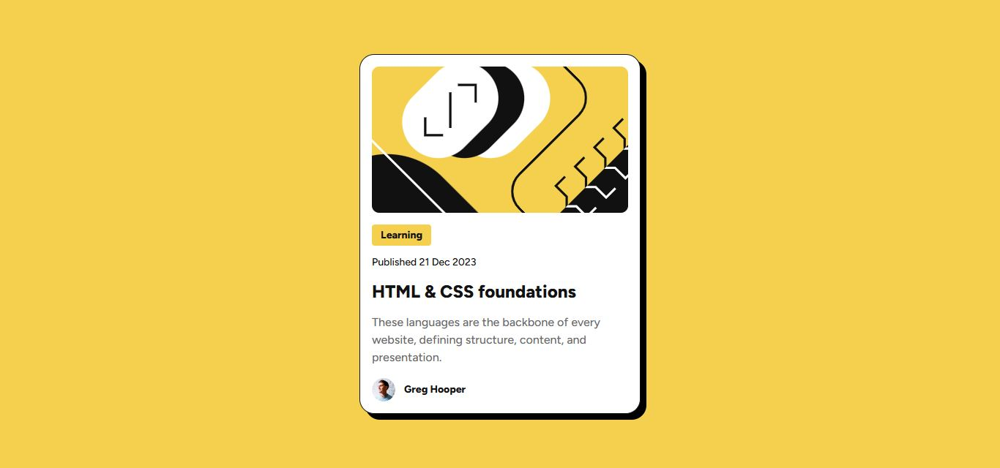

# Frontend Mentor - Blog preview card solution

This is a solution to the [Blog preview card challenge on Frontend Mentor](https://www.frontendmentor.io/challenges/blog-preview-card-ckPaj01IcS). Frontend Mentor challenges help you improve your coding skills by building realistic projects. 

## Table of contents

- [Overview](#overview)
  - [The challenge](#the-challenge)
  - [Screenshot](#screenshot)
  - [Links](#links)
- [My process](#my-process)
  - [Built with](#built-with)
  - [What I learned](#what-i-learned)
  - [Useful resources](#useful-resources)
- [Author](#author)

## Overview

### The challenge

Users should be able to:

- See hover and focus states for all interactive elements on the page

### Screenshot




### Links

- Solution URL: [https://github.com/EmmanuelIdeho/blog-preview-card](https://github.com/EmmanuelIdeho/blog-preview-card)
- Live Site URL: [https://bucolic-kangaroo-92c3e3.netlify.app/](https://bucolic-kangaroo-92c3e3.netlify.app/)

## My process

### Built with

- Semantic HTML5 markup
- CSS custom properties
- Card design

### What I learned


```html
The <picture> tag gives web developers more flexibility in specifying image resources. The most common use of the <picture> element will be for art direction in responsive designs.
```

```css
.cluster {
    display: flex;
    flex-wrap: wrap;
    gap: var(--space-150);
    justify-content: flex-start;
    align-items: center;
  }
```

### Useful resources

- [W3Schools](https://www.w3schools.com/howto/howto_css_cards.asp) - This helped me to implement the box shadow. I really liked how this website taught this pattern and will use it going forward.


## Author

- Frontend Mentor - [@yourusername](https://www.frontendmentor.io/profile/EmmanuelIdeho)
- Instagram - [@eman_thecoder](https://www.instagram.com/eman_thecoder/)


